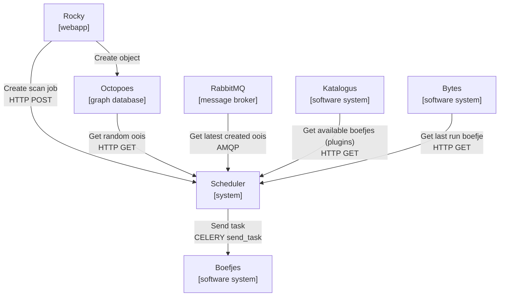
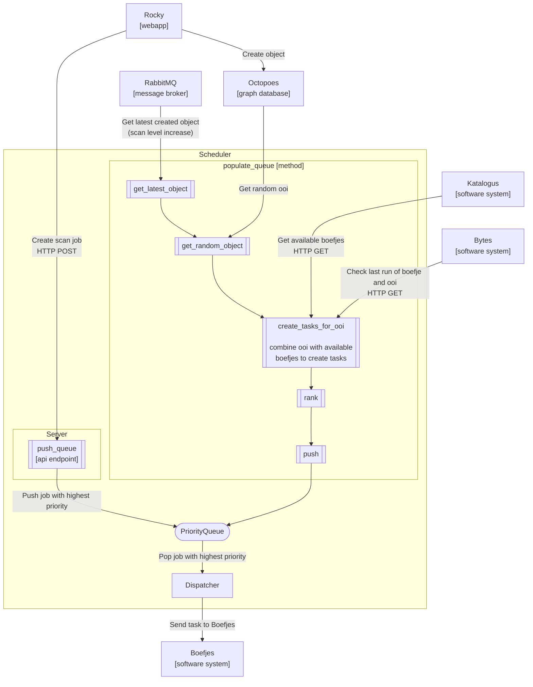
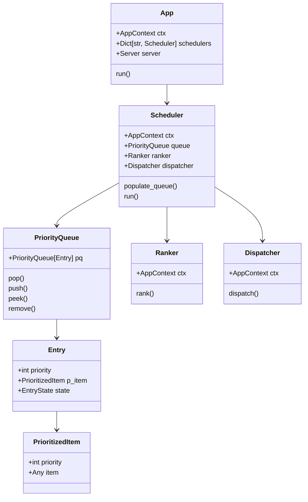

# Design scheduler

## Purpose

The *scheduler* is tasked with populating and maintaining a priority queue of
items that are ranked, and can be popped off (through api calls), or dispatched.
The scheduler is designed to be extensible, such that you're able to create
your own rules for the population, prioritization and dispatching of tasks.

The *scheduler* implements a priority queue for prioritization of tasks to be
performed by the worker(s). In the implementation of the scheduler within KAT
the scheduler is tasked with populating the priority queue with boefje and
normalizer tasks. The scheduler is responsible for maintaining and updating
its internal priority queue.

A priority queue is used, in as such, that it allows us to determine what jobs
should be checked first, or more regularly. Because of the use of a priority
queue we can differentiate between jobs that are to be executed first. E.g.
job's created by the user get precedence over jobs that are created by the
internal rescheduling processes within the scheduler.

Calculations in order to determine the priority of a job is performed by logic
that can/will leverage information from multiple (external) sources, called
`connectors`.

In this document we will outline what the scheduler does in the setup within
KAT and how it is used, and its default configuration. Further on we will
describe how to extend the scheduler to support your specific needs.

### Architecture / Design

In order to get a better overview of how the scheduler is implemented we will
be using the [C4 model](https://c4model.com/) to give an overview of the
scheduler system with their respective level of abstraction.

#### C2 Container level:

* The `Scheduler` system combines data from the `Octopoes`, `Katalogus`, `Bytes` and
  `RabbitMQ` systems. With these data it determines what tasks should be
  created and dispatched.

* The `Scheduler` system implements multiple `schedulers` per organisation.

#### C3 Component level:

* The `Scheduler` system implements multiple `schedulers`, one per
  organisation. An individual scheduler contains:

  - A queue
  - A ranker
  - A dispatcher

* A `scheduler` implements the `populate_queue` method. It will:

  - Get the latest created object in a loop, it will try to fill up the queue
    with the latest created objects.

  - When the queue isn't full, it will try and fill up the queue with random
    objects from the octopoes system.

#### C4 Code level (Condensed class diagram)

Following describes main components of the scheduler application:

* `App` - The main application class, which is responsible for starting the
  schedulers.

* `Scheduler` - The main scheduler class, which is responsible for populating
  the queue with tasks.

* `PriorityQueue` - The queue class, which is responsible for storing the
  tasks.

* `Ranker` - The ranker class, which is responsible for ranking the tasks.

* `Dispatcher` - The dispatcher class, which is responsible for dispatching
  the tasks.

* `Server` - The server class, which is responsible for handling the HTTP
  requests.

### Customizing the scheduler

Within the scheduler project you'll be able to extend the functionality with
your own procedures. The most likely customization you'll make will be
the directives of populating the queue, and ranking tasks. 

Examples on how to extend the classes can be found in their respective folders.
The files are named `boefje.py` that are a specific KAT implementations.
