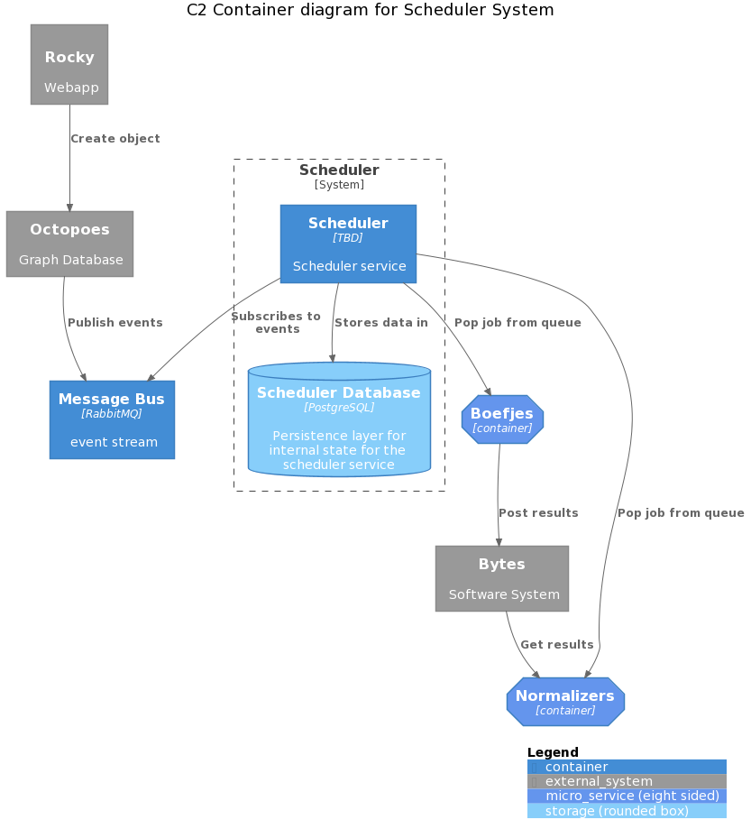
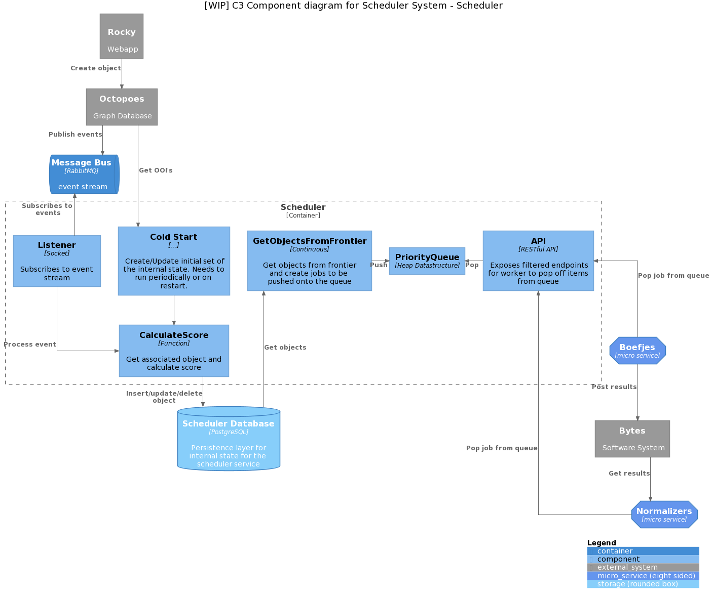

# Design scheduler

## Purpose

The *scheduler* maintains a priority queue for discovery tasks to be performed
by the workers (*boefjes* and *normalizers*). The scheduler is tasked with
maintaining and updating the priority queue with jobs that can be picked up by
the workers.

A priority queue is used, in as such, that it allows us to determine what jobs
should be checked first, or more regularly. Because of the use of a priority
queue we can differentiate between jobs that are to be executed first. E.g.
job's created by the user get precedence over jobs that are created by the
internal rescheduling processes within the scheduler.

Calculations in order to determine the priority of a job is performed by logic
that can/will leverage information from multiple sources, including but not
limited to octopoes, bytes, katalogus, pichu.

### Requirements

**Input**

Describes how we get initial state of the scheduler system, and how we add,
update, delete objects.

* The input of new jobs can be done by 2 processes:

  1. Cold start; in order to make sure that we are current and we have
     a correct representation of the state of their respective systems, we need
     to have a process that gathers all the data and persist them in the
     internal state of the scheduler. This can then be run as a sanity check,
     or as a part of the initial start of the scheduler.

     TODO: rename this, since it will be executed to make sure the internal
     state is correct, e.g. `RestoreInternalState`, `CheckInternalState`, 
     `RestoreObjects`.

  2. Event subscription; the scheduler will listen to add, delete, update
     events to update the internal state of the scheduler, as such update
     the priority/score of an object.

  For both of the boefjes, and normalizer jobs these two mechanisms need to be
  supported.

  **Boefjes**

  1. Reference octopoes in order to get new OOI's

  2. Subscribe to event channel of Octopoes

  NOTE: workers are now directly called by rocky to execute a job, in the new
  setup this will need to go through the scheduler first and then be executed
  by the workers with the highest priority. Additionally, the cron jobs that
  are now present in rocky that listen to the message queue `create_events`
  will be implemented in the scheduler.

  **Normalizers**

  1. Reference Bytes for Boefjes jobs that are done (TODO: is this the way to
     go?)

  2. Subscribe to events channel that publishes finished Boefjes jobs

  NOTE: the scheduler now references the rabbitmq queue (FIXME: what one?)
  to listen for boefjes jobs that are done.

**Scheduling and Rescheduling**

* Scheduling of objects onto the priority queue

  Suggested is to take a random set of objects, and schedule them onto the
  priority queue. However, that process needs to make sure that newly issued
  scan from the webapp (rocky) takes precedence and are pushed onto the queue.

* Process of rescheduling of tasks that already have been completed

  Based on the change of findings (and additional scoring features) for a
  particular object, the score/priority for the object will be updated
  resulting in objects being rescheduled more/less often. 

**Priority Queue**

* Finite (configurable) number of items in the priority queue

* Priority queue is implemented as a heap and maintained in memory 

* Recreate state of priority queue from persistent storage

* Two queues need to be implemented, one for boefjes, and one for normalizers

**Calculation**

* Should be able to implement different calculation strategies for determining
  the priority of a task, and maintaining order. At least it should be able to
  easily be extended to include more strategies, or other strategies.

* Take into account organization's scan profile level

* Accesses multiple 'external' services to determine the priority of a task

**Output**

* Expose API for tasks to be popped of the priority queue, initially as a
  RESTful API. Should be extensible to support other API protocols when needed.

* A worker should be able to ask for a specific task for that worker to be
  popped of the queue. It should have no knowledge of jobs that are are
  scheduled for other workers.

## Architecture

Following describes main processes of the scheduler:

* `ColdStart` - process that gathers all object and persist them in the
  internal state (the `frontier`) of the scheduler ready for scheduling.

* `Listener` - process that listens on a channel for object changes 
  (at the moment this is `create_events`), and persists those objects into
  the database table `frontier`.

* `CalculateScore` - process that calculates the score of an object based on
  the change in findings and other factors.

* `GetObjectsFromFrontier` process, takes objects from the `frontier` table and
  schedules them for execution. This pushes objects onto the priority queue
  `AddToQueue`.

* `API` allows worker to pop off jobs from the priority queue, filtered by
   their worker type.

See the [C4 model](https://c4model.com/) overview of the scheduler system
below, with their respective level of abstraction.

C2 Container level:

C3 Component level:

## Design decisions / Open questions

* Boefjes scan jobs are now being called directly through the rabbitmq
  `boefjes` channel by rocky, leveraging celery, the intention is to replace
  this with by the scheduler.

* Rocky cron jobs, that are checking the `create_events` channel, need to be
  replaced by the scheduler.

* Do we maintain the priority queue within the scheduler or do we leverage
  other services (e.g. redis) to maintain the queue?

  Suggested is that we keep the priority queue within the scheduler in memory.
  We can also program it generalized enough that other backends can be used
  or swapped with minimal effort. At this moment there would be too much
  overhead on using external services, and can be implemented more easily
  within the scheduler service and allows us more flexibility .

* What types of channels does the scheduler maintain to receive/input new tasks
  to be pushed onto the priority queue? E.g. and API to post jobs to the
  scheduler, a listener on to a message queue channel, and active process that
  looks for interesting findings to be posted to the scheduler? A combination
  of these, or all of them?

  Suggested is to have a event stream channel(s) to which the scheduler
  subscribes to. Significant event types are:

  **Boefjes**:

  * Add OOI events by boefjes
  * Indemnification events
  * Scan events

  TODO: incomplete, what normalizer events?

* How do we keep track of the status of job, meaning do we need to poll to
  check if it has been processed by the workers, or do we wait for
  confirmation, will this be posted on a event channel?

  When a scan job has been completed is known by `bytes`. Suggested is to
  check outstanding jobs that have been done in a specific time frame, when
  the job failed it should get a higher priority. (TODO: is this correct?)

* Do we want a mechanism to override the priority of a task?

  Suggested is to solve this with deduplication and save highest priority
  (TODO: unsure)

* Can we use the same data structure that are used for the boefjes in the
  `test/examples/` directory, for the objects that are on the priority queue?

  Suggested is to use `JobMeta` model, the object that is popped off the
  queue would be json serializable and should contain:

  * the input OOI
  * boefje container image
  * environment settings

* For the queue `create_events` is there a offset available?

  See coldstart need to reference octopoes, and that is your offset

* Decide what the priority score for object on the priority queue should be.
  E.g. the scan level?

  Priority is based on delta of change of an OOI

* For call to calculate the `CalculateScore`, do we want to let the scheduler
  listen to a channel to check when a job is finished, and then update the
  object? Or do we want to expose an API (e.g. rpc) to update it, so that the
  responsibility lies with the workers?

  The scheduler will listen to an event stream (or additionally get info
  from `bytes` when a scan job is completed) update the internal state of an
  object, and update the priority of the object.

* What external services are available and do we want to use in order to 
  calculate the `CalculateScore`?

  * Bytes; historical information of when a boefje has run, on a specific OOI
  * Katalogus; what boefje can be used with what OOI (TODO: permutation set?)
  * Pichu; indemnification set
  * Octopoes; tells what findings there are found with every OOI
