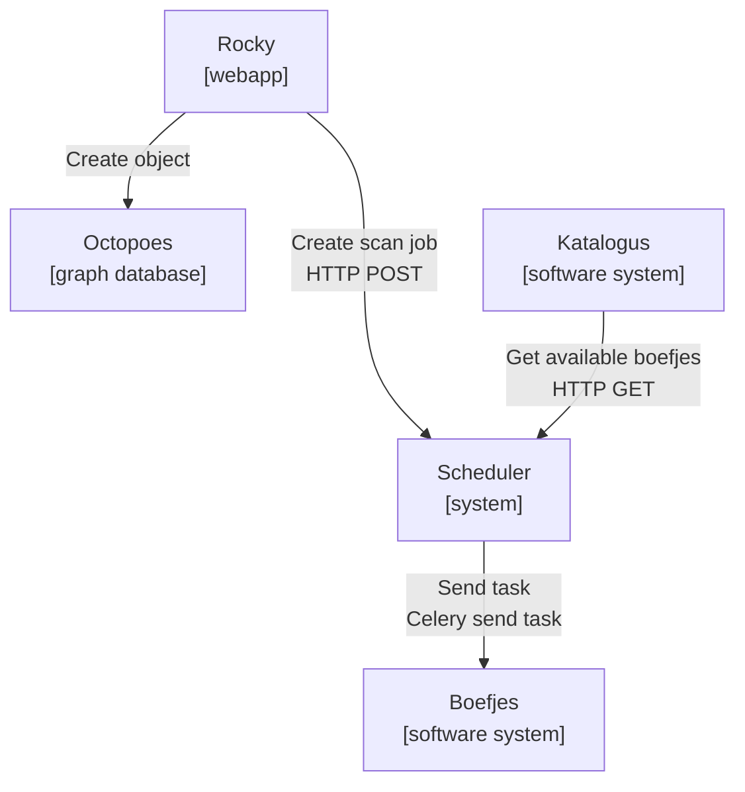
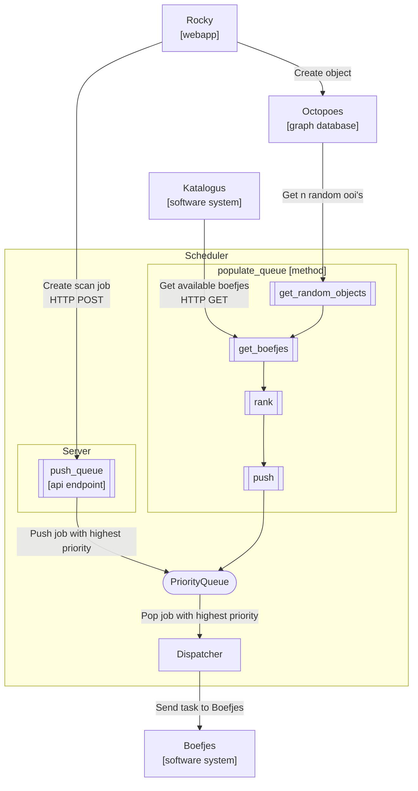
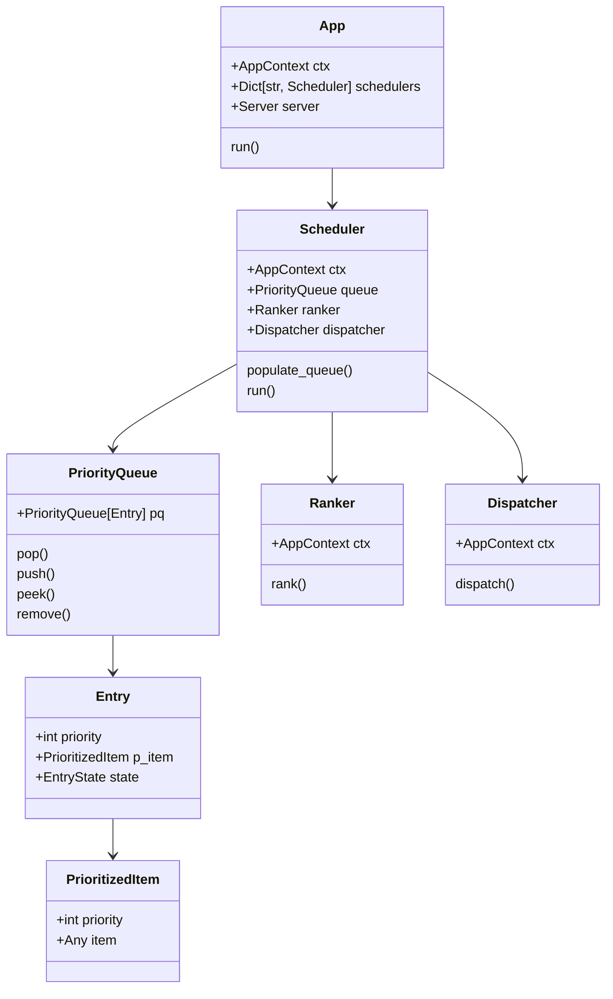

# Design scheduler

## Purpose

The *scheduler* is tasked with populating and maintaining a priority queue of
items that are ranked that can be popped off through api calls, or dispatched.

The scheduler is designed to be extensible ...

The *scheduler* maintains a priority queue for discovery tasks to be performed
by the workers (*boefjes* and *normalizers*). The scheduler is tasked with
maintaining and updating the priority queue with jobs that can be picked up by
the workers.

A priority queue is used, in as such, that it allows us to determine what jobs
should be checked first, or more regularly. Because of the use of a priority
queue we can differentiate between jobs that are to be executed first. E.g.
job's created by the user get precedence over jobs that are created by the
internal rescheduling processes within the scheduler.

Calculations in order to determine the priority of a job is performed by logic
that can/will leverage information from multiple sources, including but not
limited to octopoes, bytes, katalogus, pichu.

### Architecture / Design

### Implementation 

### Requirements

**Input**

Describes how we get initial state of the scheduler system, and how we add,
update, delete objects.

* The input of new jobs can be done by 3 processes:

  1. `populate_queue` takes a random `n` number of OOI's from octopoes and
     ranks them by their score. This is done continuously until the queue is
     full.

  2. Creation of a scan job through the API. This supports the creation of
     jobs that have the highest priority. E.g. scan jobs that are created by
     by the user.

  3. Message bus listener(s) that subscribes to the events channels and listens
     to events to update the internal state of the scheduler priority queue,
     as such update the priority/score of an object.

  For both of the boefjes, and normalizer jobs these two mechanisms need to be
  supported.

  **Boefjes**

  1. Reference octopoes in order to get new OOI's

  2. Subscribe to event channel of Octopoes

  **Normalizers**

  1. Reference Bytes for Boefjes jobs that are done.

  2. Subscribe to events channel that publishes finished Boefjes jobs

**Scheduling and Rescheduling**

* Scheduling of objects onto the priority queue

  A random set of objects is taken, and are scheduled onto the priority queue.
  However, that process needs to make sure that newly issued scan jobs from the
  user  takes precedence and are pushed onto the queue with the highest
  priority.

* Process of rescheduling of tasks that already have been completed

  Based on the change of findings (and additional scoring features) for a
  particular object, the score/priority for the object will be updated
  resulting in objects being rescheduled more/less often. 

**Priority Queue**

* Finite (configurable) number of items in the priority queue

* Priority queue is implemented as a heap and maintained in memory 

* Two queues need to be implemented, one for boefjes, and one for normalizers

* Duplication of jobs is not allowed, and will be removed from the queue

**Calculation**

* Should be able to implement different calculation strategies for determining
  the priority of a task, and maintaining order. At least it should be able to
  easily be extended to include more strategies, or other strategies.

* Take into account organization's scan profile level

* Accesses multiple 'external' services to determine the priority of a task

**Output**

* Expose API for tasks to be popped of the priority queue, initially as a
  RESTful API. Should be extensible to support other API protocols when needed.

* A worker should be able to ask for a specific task for that worker to be
  popped of the queue. It should have no knowledge of jobs that are are
  scheduled for other workers.

## Architecture

Following describes main processes of the scheduler:

* `PopulateQueue` - continuous process that populates the priority queue with
  objects that are ready for scheduling.

* `Listener` - process that listens on a channel for object changes 
  (at the moment this is `create_events`), and persists those objects into
  the database table `frontier`.

* `Ranker` - process that calculates the score of an object based on
  the change in findings and other factors.

* `Server` allows workers to pop off jobs from the priority queue, filtered by
   their worker type.

See the [C4 model](https://c4model.com/) overview of the scheduler system
below, with their respective level of abstraction.

C2 Container level *Current situation*:

C3 Component level *Current situation*:

C4 Code level (Condensed class diagram)

